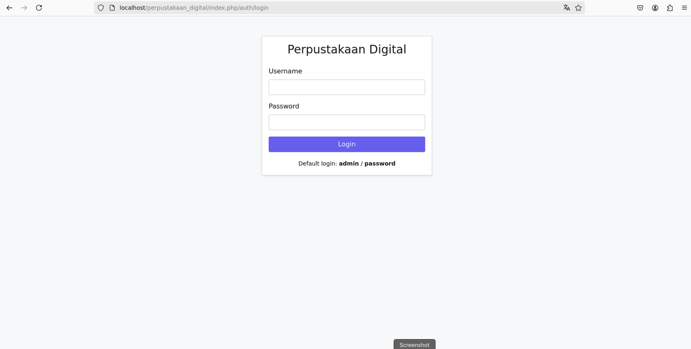
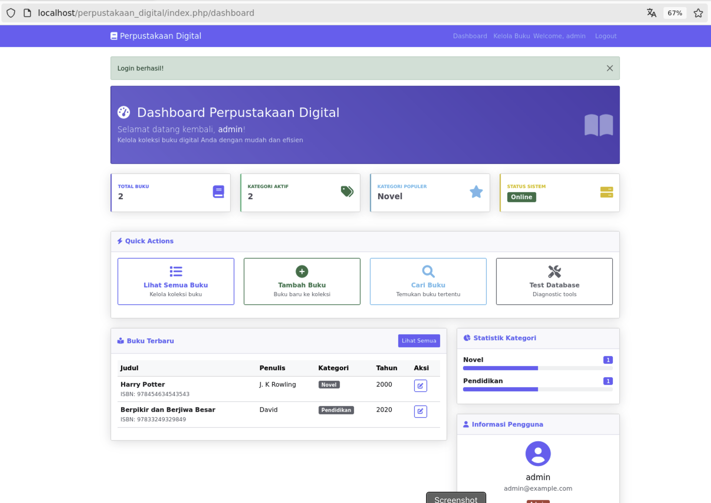
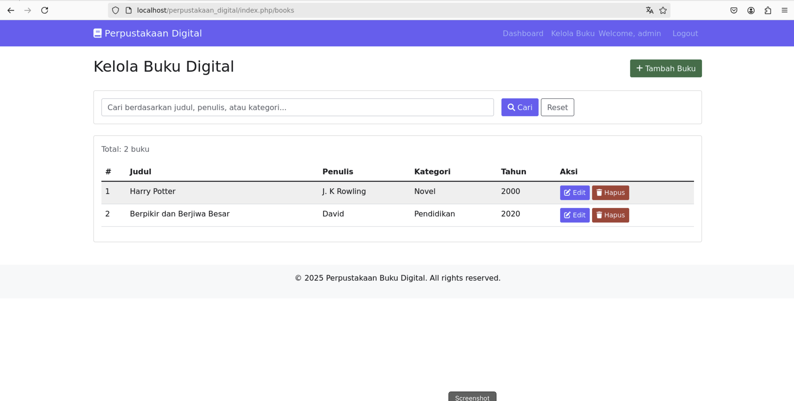
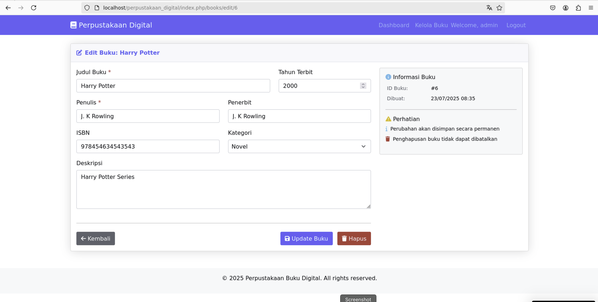

# Perpustakaan Buku Digital

Sistem manajemen perpustakaan digital berbasis web menggunakan CodeIgniter 3 dan MySQL.

## Features

- ✅ **Authentication System** - Login/logout dengan session management
- ✅ **CRUD Operations** - Create, Read, Update, Delete untuk manajemen buku
- ✅ **Search & Pagination** - Pencarian buku dengan pagination
- ✅ **Dashboard** - Interface admin dengan statistik
- ✅ **Responsive Design** - Bootstrap 5 untuk tampilan yang responsif

## Screenshots

### Dashboard

### Dashboard

### Book Management

### Book Management

## Requirements

- PHP 7.4 atau lebih baru
- MySQL 5.7 atau lebih baru
- Apache Web Server
- CodeIgniter 3.1.13

## Installation

### 1. Clone Repository
git clone https://github.com/yourusername/perpustakaan-digital.git
cd perpustakaan-digital

### 2. Database Setup
CREATE DATABASE perpustakaan_digital CHARACTER SET utf8 COLLATE utf8_general_ci;

Import database structure:

mysql -u root -p perpustakaan_digital < database/perpustakaan_digital.sql

### 3. Configuration
Copy database configuration
cp application/config/database.php.example application/config/database.php

Edit database settings
nano application/config/database.php

Update database credentials:

‘hostname’ => ‘localhost’,
‘username’ => ‘your_username’,
‘password’ => ‘your_password’,
‘database’ => ‘perpustakaan_digital’,

### 4. Set Permissions
chmod -R 755 .
chmod -R 777 application/logs
chmod -R 777 assets/uploads

### 5. Web Server Setup
Point your web server to the project directory and access via browser.

## Default Login

- **Username:** admin
- **Password:** password

## Project Structure

perpustakaan_digital/
├── application/
│   ├── controllers/     # Controllers (Auth, Books, Dashboard)
│   ├── models/         # Models (User_model, Book_model)
│   ├── views/          # Views (templates, forms)
│   └── config/         # Configuration files
├── system/             # CodeIgniter framework
├── assets/             # CSS, JS, images
└── database/           # SQL files

## Usage

1. **Login** ke sistem menggunakan kredensial admin
2. **Dashboard** menampilkan statistik dan overview sistem
3. **Kelola Buku** untuk menambah, edit, hapus, dan cari buku
4. **Logout** untuk keluar dari sistem

## Contributing

1. Fork repository ini
2. Buat branch fitur baru (`git checkout -b feature/amazing-feature`)
3. Commit perubahan (`git commit -m 'Add amazing feature'`)
4. Push ke branch (`git push origin feature/amazing-feature`)
5. Buat Pull Request

## License

Distributed under the MIT License. See `LICENSE` for more information.

## Contact

Your Name - your.email@example.com

Project Link: [https://github.com/yourusername/perpustakaan-digital](https://github.com/yourusername/perpustakaan-digital)

Step 5: Create Database Export
Export your database structure:
# Create database directory
mkdir database

# Export database structure and sample data
mysqldump -u root -p perpustakaan_digital > database/perpustakaan_digital.sql

# Create index.html for security
echo "<html><head><title>403 Forbidden</title></head><body><h1>Directory access is forbidden.</h1></body></html>" > database/index.html

Step 6: Add Files to Git
# Add all files
git add .

# Check what will be committed
git status

# Make initial commit
git commit -m "Initial commit: Perpustakaan Buku Digital v1.0

Features:
- Authentication system with session management
- CRUD operations for book management
- Search and pagination functionality
- Professional dashboard with statistics
- Responsive Bootstrap design
- MySQL database integration"

Step 7: Create GitHub Repository
Via GitHub Website:
	1.	Go to github.com
	2.	Click “New” or “New Repository”
	3.	Repository name: `perpustakaan-digital`
	4.	Description: “Digital Library Management System with CodeIgniter”
	5.	Select Public or Private
	6.	Don’t initialize with README (you already have one)
	7.	Click “Create Repository”
Step 8: Connect and Push to GitHub
# Add remote origin (replace YOUR_USERNAME)
git remote add origin https://github.com/YOUR_USERNAME/perpustakaan-digital.git

# Push to GitHub
git branch -M main
git push -u origin main

